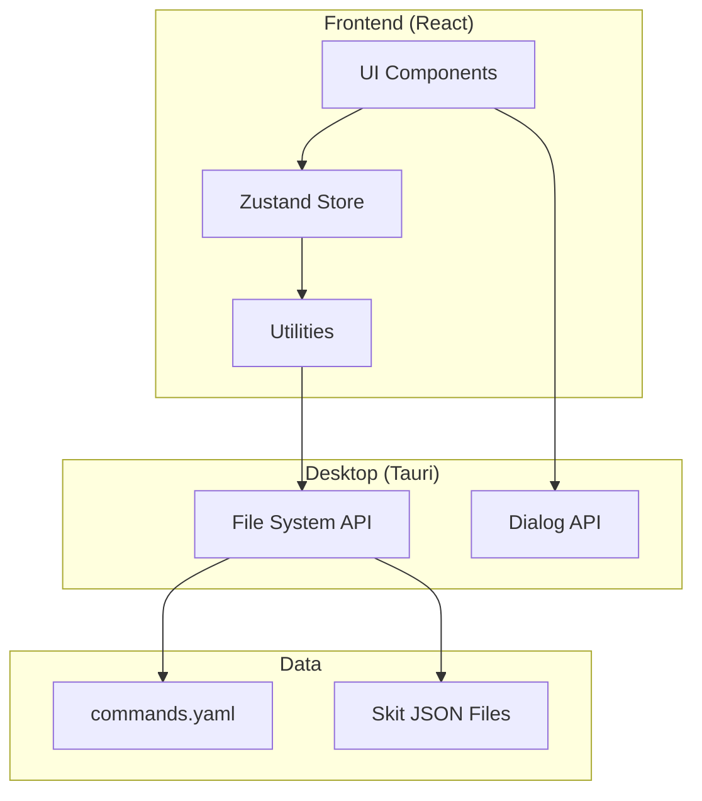

# CommandForgeEditor Overview

## 概要

CommandForgeEditorは、ゲームシナリオスクリプト（「スキット」）をノーコードで作成・編集するためのクロスプラットフォームデスクトップアプリケーションです。ReactベースのモダンなUIとTauriによるネイティブデスクトップ機能を組み合わせ、直感的なビジュアルスクリプティング体験を提供します。

## 主な特徴

### 1. ビジュアルスクリプティング
- ドラッグ＆ドロップによるコマンドの並び替え
- グループ化によるコマンドの階層管理
- リアルタイムプレビューと検証

### 2. 柔軟なコマンドシステム
- YAMLベースのコマンド定義
- カスタムコマンドタイプの追加が容易
- 動的プロパティシステム

### 3. 生産性向上機能
- マルチセレクト対応
- コピー/カット/ペースト
- アンドゥ/リドゥ
- キーボードショートカット

### 4. データ検証
- JSON Schemaによるリアルタイム検証
- 必須プロパティチェック
- 型安全性の確保

## プロジェクト構成

```
CommandForgeEditor/
├── frontend/               # Reactアプリケーション
│   ├── src/
│   │   ├── components/    # UIコンポーネント
│   │   ├── store/        # 状態管理（Zustand）
│   │   ├── types/        # TypeScript型定義
│   │   └── utils/        # ユーティリティ関数
│   └── src-tauri/        # Tauriバックエンド
├── memory-bank/          # プロジェクトドキュメント
└── specification/        # 仕様書

```

## 技術スタック

### フロントエンド
- **React 18**: UIフレームワーク
- **TypeScript**: 型安全性
- **Vite**: ビルドツール
- **Zustand + Immer**: 状態管理
- **Tailwind CSS**: スタイリング
- **Shadcn UI**: UIコンポーネントライブラリ
- **@dnd-kit**: ドラッグ＆ドロップ

### デスクトップ統合
- **Tauri**: Rustベースのデスクトップフレームワーク
- **File System API**: ファイル操作
- **Dialog API**: ネイティブダイアログ

### 開発ツール
- **Vitest**: ユニットテスト
- **Playwright**: E2Eテスト
- **ESLint**: コード品質
- **GitHub Actions**: CI/CD

## アーキテクチャ概要



## データフロー

1. **初期化**: コマンド定義の読み込み → スキットファイルの読み込み → UIの初期化
2. **編集**: ユーザー操作 → Storeの更新 → UIの再レンダリング → 検証
3. **保存**: 検証 → JSONシリアライズ → ファイル書き込み

## 次のステップ

- [アーキテクチャ詳細](./02-architecture.md)
- [データモデル](./03-data-models.md)
- [コンポーネント構成](./04-components.md)
- [状態管理](./05-state-management.md)